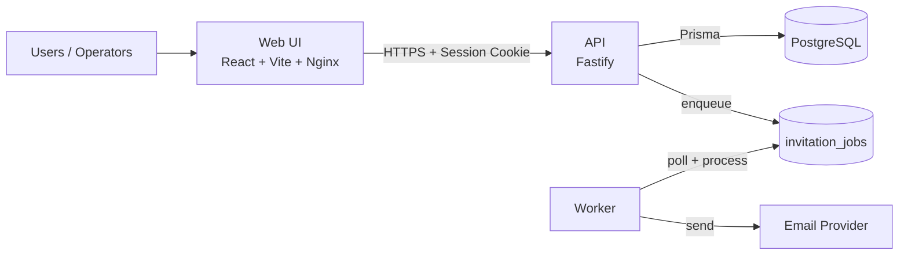

# Dharma Events

A lightweight, self-hosted event registration, QR check-in and attendance
platform. See `REQUIREMENTS.md` for full requirements and
`docs/IMPLEMENTATION_STATUS.md` for current progress.

**Status:** All phases (0–9) complete, including Phase 9 (Event
Simulation).

## Quickstart (developer)

1. Install prerequisites:

```bash
# Node 20+, pnpm 10+, Docker Compose
corepack enable
corepack prepare pnpm@10.33.2 --activate
```

2. Install and prepare environment:

```bash
pnpm install
cp .env.example .env    # edit values (DATABASE_URL, EMAIL_*, etc.)
```

3. Start local Postgres for development:

```bash
docker compose -f compose.dev.yml up -d
```

4. Run database migrations (first time / after migrations added):

```bash
pnpm --filter @dharma-events/database run prisma:migrate
```

5. Bootstrap an admin user (one-liner):

```bash
ADMIN_EMAIL=admin@example.com ADMIN_PASSWORD=change_me ADMIN_NAME="Admin" \
  pnpm --filter @dharma-events/api run bootstrap:admin
```

6. Start services in separate terminals:

```bash
pnpm dev:api      # Fastify API on http://localhost:3000
pnpm dev:web      # Vite dev server on http://localhost:5173 (proxies /api)
pnpm dev:worker   # background worker
```

7. Run tests and checks:

```bash
pnpm lint
pnpm typecheck
pnpm test
```

## Architecture (overview)

- Monorepo (pnpm workspace) with packages:
  - apps/api — Fastify server, Prisma database access, auth, import, reports
  - apps/web — React + Vite UI, TanStack Query for data fetching
  - apps/worker — background jobs for invitations, mailer, retries
  - packages/database — Prisma schema & client
  - packages/shared — shared utilities (env loading, QR/token helpers, PDFs)

Notes and hotspots:
- Invite/attachment PDFs are stored in Postgres as binary columns — monitor DB size and backup performance.
- Native dependencies (e.g. @node-rs/argon2) require platform-aware CI / builder images.
- Security: cookie/session handling, CORS, rate-limiting, and helmet are present; verify cookie flags and HTTPS in production.

### Visual architecture



Detailed technical architecture: `docs/ARCHITECTURE.md`.

## CI / GitHub

A GitHub Actions workflow is included at `.github/workflows/ci.yml` which runs:
- pnpm install (cached)
- lint
- typecheck
- tests

Recommended: enable branch protection for `main`, require CI checks and PR reviews, and add repository secrets (DATABASE_URL, MAILER credentials) for CI/deploy.

## Run Migrations (production)

```bash
# After pushing to production servers/containers
docker compose up -d --build
docker compose exec api sh -c "cd /repo/packages/database && node_modules/.bin/prisma migrate deploy"
```

## Backup & Restore

- Backup: `./scripts/backup.sh` (rotates daily/weekly/monthly)
- Restore: `./scripts/restore.sh /path/to/dharma_events_TIMESTAMP.sql.gz` (destructive)

## Contributing

- Follow the monorepo scripts: `pnpm lint`, `pnpm typecheck`, `pnpm test`.
- Open feature branches and PRs against `main`. Use the CI workflow to verify changes.

## Troubleshooting

- `Invalid environment configuration` on startup: check `.env` against `.env.example` — `packages/shared`'s `loadEnv()` prints helpful errors.
- `pnpm install` failures: confirm Node and pnpm versions.

## Further documentation

- Design and feature notes: `DHARMA_EVENTS_REQUIREMENTS_AND_DESIGN.md`
- Quickstart: `docs/QUICKSTART.md`
- User guide: `docs/USER_GUIDE.md`
- Architecture: `docs/ARCHITECTURE.md`
- Deployment notes: `docs/SYNOLOGY_DEPLOYMENT.md`
- Implementation status and diagrams: `docs/IMPLEMENTATION_STATUS.md`
