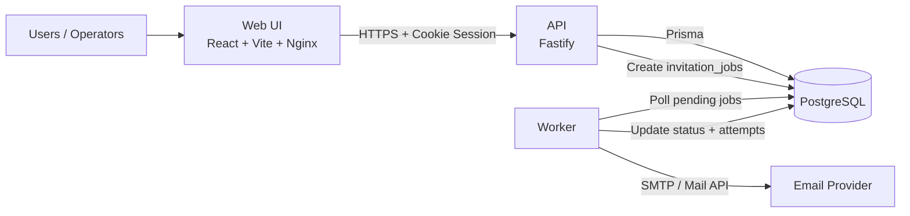
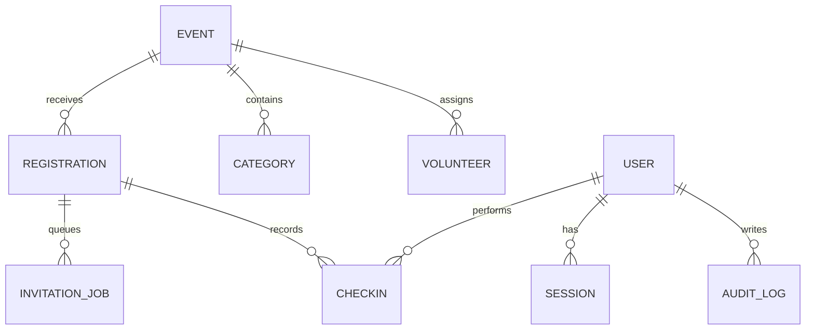
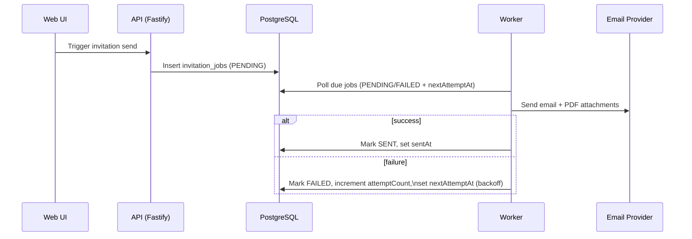

# Dharma Events — Architecture

This document provides a technical view of runtime components, data flow, and operational hotspots.

## 1. Workspace layout

| Area | Path | Purpose |
|---|---|---|
| API | `apps/api` | Fastify HTTP API, auth, imports, check-ins, reports |
| Web | `apps/web` | React SPA (Vite), operator UI, scanner flow |
| Worker | `apps/worker` | Invitation queue processing, retries, email sends |
| Database package | `packages/database` | Prisma schema, migrations, generated client |
| Shared package | `packages/shared` | Env validation, QR/token, PDF/email helper logic |

## 2. System context

## 3. Core domain model

## 4. Invitation processing flow

## 5. Design choices and implications

1. **Single Postgres source of truth**: all operational data is persisted in one relational store with Prisma migrations.
2. **Attachments in database (`bytea`)**: simplifies deployment (no shared volume) but increases backup size and restore time.
3. **Immutable check-in and audit rows**: preserves history and supports compliance/auditability.
4. **Dedicated worker for async tasks**: avoids blocking request/response flows and enables retry policies.

## 6. Hotspots to monitor

1. **Storage growth**: binary invite attachments can grow `events/categories` row size and total DB footprint.
2. **Job latency**: watch backlog and retry rate in `invitation_jobs` to detect mailer degradation.
3. **Security posture**: enforce HTTPS and secure cookie/session settings in production.
4. **Native dependencies in CI/CD**: ensure target-compatible builds for native modules (e.g., argon2 bindings).

## 7. Related docs

- `docs/QUICKSTART.md`
- `docs/SYNOLOGY_DEPLOYMENT.md`
- `docs/IMPLEMENTATION_STATUS.md`
- `DHARMA_EVENTS_REQUIREMENTS_AND_DESIGN.md`
