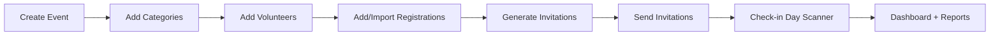

# Dharma Events — User Guide

This guide is for event teams using Dharma Events day-to-day.

## 1. What you can do in Dharma Events

- Create and manage events
- Add categories and volunteers
- Add registrations manually or import from Excel/CSV
- Generate and send invitation emails with QR tickets
- Scan QR codes at entry and track attendance live
- Export attendance, check-in, and invitation reports

## 2. Sign in and roles

1. Open the app URL (for local setup this is usually `http://localhost:5173`).
2. Sign in with your email and password.
3. Your role controls what tabs and actions you can access.

### Role permissions

| Area | ADMIN | EVENT_MANAGER | SUPERVISOR | VOLUNTEER |
|---|---|---|---|---|
| View events list | Yes | Yes | Yes | Yes |
| Create new event | Yes | Yes | No | No |
| Event overview | Yes | Yes | Yes | No |
| Manage categories/volunteers/settings | Yes | Yes | No | No |
| Registrations | Yes | Yes | Yes | No |
| Invitations | Yes | Yes | No | No |
| Scanner (check-in) | Yes | Yes | Yes | Yes |
| Supervisor override/reverse check-in | Yes | Yes | Yes | No |
| Dashboard + reports | Yes | Yes | Yes | No |
| Permanently delete events (Manage Events) | Yes | No | No | No |

## 3. Recommended workflow for each event

## 4. Event setup (Admin/Event Manager)

1. Go to **Events**.
2. Click **+ New Event**.
3. Enter Event Code, Event Name, and Event Date.
4. Open the event and go to **Overview**.
5. Configure:
   - **Registration open**
   - **Check-in open**
   - **Status** (`DRAFT`, `ACTIVE`, `COMPLETED`, `ARCHIVED`)
6. Add **Categories** (for example: VIP, General, Donor).
7. Add **Volunteers** (name, email, optional phone, duty/role).
8. (Optional) Upload invite PDFs:
   - Event-level attachment (used for all invitations by default)
   - Category-level template (overrides event-level for that category)

## 5. Registrations

Open the event and go to **Registrations**.

### Add one registration manually

1. Fill in name, email, optional phone, attendee count.
2. Select category and optional volunteer.
3. Click **Add registration**.

### Import from spreadsheet

1. Click **Download blank template (.xlsx)**.
2. Fill rows in the template.
3. Upload file (`.xlsx` or `.csv`) and click **Preview**.
4. Review:
   - `VALID` rows import normally
   - `WARNING` rows import with warnings
   - `ERROR` rows are skipped
5. Click **Import valid rows**.

### Search registrations

Use the search box by name, email, phone, or registration number.

## 6. Invitations

Open the event and go to **Invitations**.

1. Click **Generate Invitations** (creates/refreshes invitation jobs).
2. Review counts in summary cards: Total, Ready, Pending, Sent, Failed.
3. Click **Send All Ready** to send ready invitations.
4. Use **Preview PDF** per registration.
5. Use **Resend** for a single participant when needed.

Invitation statuses:
- `NOT_SENT`: not prepared/sent yet
- `PENDING`: queued/in progress
- `SENT`: delivered successfully
- `FAILED`: delivery failed (can be retried)

## 7. Check-in (Scanner)

Open the event and go to **Check-in**.

### QR scanning

1. Click **SCAN QR**.
2. Allow camera access in browser.
3. Scan participant QR code.
4. Confirm **Arriving now** count.
5. Click **CHECK IN**.

### Manual fallback (if camera unavailable)

1. Use **Search Participant** by name/phone/reg ID.
2. Open participant record.
3. Complete check-in from the same screen.

### Supervisor/Admin actions

- **Override check-in**: if participant exceeds remaining count (requires reason)
- **Reverse check-in**: undo a check-in entry (requires reason)

## 8. Dashboard and reports

Open the event and go to **Dashboard**.

You can monitor:
- Total registrations/capacity/arrived/remaining
- Attendance %
- Category-wise and volunteer-wise performance
- Arrival timeline
- Recent check-ins

Download reports in **CSV** or **XLSX**:
- Attendance
- No-show
- Check-in transactions
- Invitation delivery

## 9. Manage Events (Admin only)

Use **Manage Events** to permanently delete test/duplicate events.

Important:
- Deletion is irreversible.
- You must type the event code to confirm.
- Deleting an event removes registrations, invitations, check-ins, categories, and volunteers tied to that event.

## 10. Troubleshooting

- **Cannot sign in**: verify credentials and account role.
- **No permission message**: your role does not allow this page/action.
- **Camera not working**: allow browser camera permission or use manual search.
- **Invitation send failures**: verify recipient email and mailer configuration.
- **Import errors**: use template format and fix highlighted preview errors.

## 11. Best practices

1. Keep event status and open/close toggles updated.
2. Use import preview every time before committing bulk registrations.
3. Send a small invitation batch first, then send all.
4. Use supervisor overrides sparingly and always record clear reasons.
5. Export end-of-day reports for record keeping.
